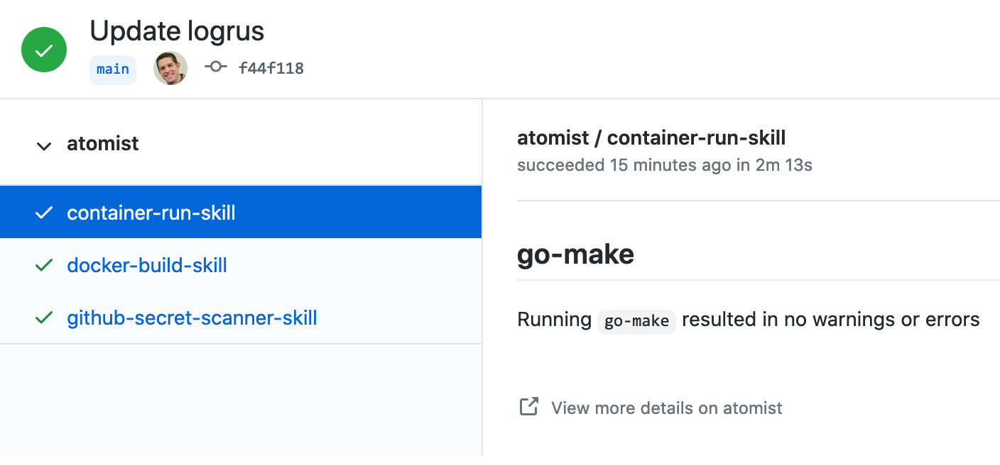

Run any command in a Docker image whenever you want! You can trigger container
skill executions when standard GitHub and chat events occur, on a regular
schedule, or whenever you send a custom event. For example, you can:

-   Run your favorite linter, code formatter, or code scanner in response to a
    push
-   Send your new team members welcome messages when they join certain channels
    in Slack or Microsoft Teams
-   Close a Jira issue when a Jenkins build completes successfully
-   Rebuild Docker images when their `FROM` image has a new version

The Docker Container Runner skill runs a Docker image, any Docker image, when an
event happens. Since you define the Docker image and are able to define custom
events and event payloads, container skills basically let you run _anything you
want whenever you want_. In other words, container skills provide a powerful
tool to trigger or schedule any task imaginable.

### GitHub commit check

