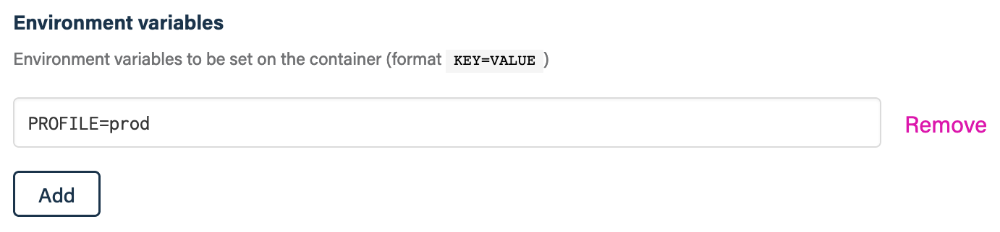

# `atomist/container-run-skill`

Run Docker containers as reactions to Git pushes

<!---atomist-skill-readme:start--->

# What it's useful for

Run any command in a Docker image, triggered by pushes to repositories. Run your favorite
linter, code formatter, code scanner or any other task that you want to run in response to a push.

# Before you get started

Connect and configure this integration:

-   **GitHub**
-   **Docker Registry**
-   **Slack or Microsoft Teams**
-   **Google Cloud Platform**
-   **Maven Repository**

The **GitHub** integration must be configured in order to use this skill. At least one repository must be selected.
The other integrations are optional and only needed if you plan to use any of these integrations from your container.

This skill imposes restrictions on the running Docker containers. If you would like to know more about resource
limits and quotas, [contact us](mailto:support@atomist.com).

# How to configure

1. **Select the trigger to run this skill**

    You can select one or more triggers to start this skill. Refer to the [documentation](https://github.com/atomist-skills/container-run-skill/blob/master/docs/CONTRACT.md#trigger-payloads)
    on the various event payloads available.

1. **Select the Docker image to run**

    

    This skill can run any public Docker image in response to a Git push or other triggers.

    Enter the complete Docker image name, eg. `ubuntu:latest` or `gcr.io/kaniko-project/executor:v0.19.0`.

    Note: Support for running private Docker images is under development. Contact
    us if you would like to run your own private images.

1. **Provide entrypoint or command to run**

    

    Configure the command and arguments that you want to run inside the container.
    For example:

    `/bin/sh -c "echo $(cd /atm/home && ls -la | wc -l)"`

    Alternatively, you can provide a public HTTP url to a shell script that you want
    to run, or a repository slug in the format `owner/repository` to a public repository
    containing a `skill.sh` which will be used as entrypoint for the container.

    Refer to the [documentation](https://github.com/atomist-skills/container-run-skill/blob/master/docs/CONTRACT.md#entrypoint) to learn more about possible image and entrypoint combinations.

1. **Provide optional environment variables**

    

    Specify any environment variables needed for your image and commands to run. The environment variable format is `KEY=VALUE`. For example:

    `GIT_URL=https://github.com`

1. **Overwrite the working directory**

    

    By default this skill doesn't change the working directory of the container. Use this setting to provide an
    explicit working directory for your container.

    The working directory `/atm/home` contains the cloned sources of the repository you pushed to.

1. **Enable file caching for faster execution times**

    You can speed up executions times by enabling file caching for certain artifacts — for example, dependencies —
    by providing glob patterns of files you'd like to cache between executions.

    Note that only files within the `/atm/home` directory can be cached.

    Caching Maven dependencies from a local repository could be accomplished with the following pattern:

    `.m2/**`

    To instruct Maven to download dependencies into the `/atm/home/.m2` directory, provide an additional parameter to the
    Maven command line: `mvn install -Dmaven.repo.local=/atm/home/.m2`

1. **Determine repository scope**

    

    By default, this skill will be enabled for all repositories in all organizations you have connected.

    To restrict the organizations or specific repositories on which the skill will run, you can explicitly choose
    organization(s) and repositories.

# How to use the Container Run Skill

1. **[Review the Docker container contract and available triggers](https://github.com/atomist-skills/container-run-skill/blob/master/docs/CONTRACT.md)**

1. **Configure the skill, set Docker image, command and environment variables**

1. **Every time you push to a repository, the Docker container will run**

To create feature requests or bug reports, create an [issue in the repository for this skill](https://github.com/atomist-skills/container-run-skill/issues).
See the [code](https://github.com/atomist-skills/container-run-skill) for the skill.

<!---atomist-skill-readme:end--->

---

Created by [Atomist][atomist].
Need Help? [Join our Slack workspace][slack].

[atomist]: https://atomist.com/ "Atomist - How Teams Deliver Software"
[slack]: https://join.atomist.com/ "Atomist Community Slack"
