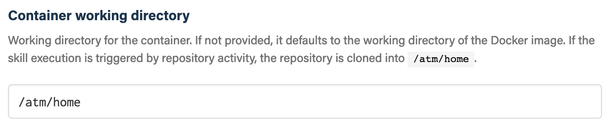

## Before you get started

Connect and configure these integrations:

1.  [**GitHub**](https://go.atomist.com/catalog/integration/github "GitHub Integration")
    _(required)_
1.  [**Docker Hub Registry**](https://go.atomist.com/catalog/integration/docker-hub "Docker Hub Registry")
    or
    [**Google Container Registry**](https://go.atomist.com/catalog/integration/google-container-registry "Google Container Registry (GCR)")
    _(optional)_
1.  **Secrets** _(optional)_

## How to configure

1.  **Select Docker registries**

    

    If your container uses a private Docker image, select the Docker registry
    from which that image is pulled. If you are using a public Docker image,
    i.e., pulling the Docker image requires no credentials for authorization,
    you can leave this empty.

1.  **Select the trigger to run this skill**

    

    You can select one or more events to trigger an execution of this skill. See
    the
    [Container Skill - Triggers](https://docs.atomist.com/authoring/container-skills/#triggers)
    documentation for more information on the types of events available and the
    event data the skill runtime makes available to the container.

1.  **Docker image to run**

    

    Provide the Docker image to execute in a container. Enter the complete
    Docker image name, e.g., `ubuntu:latest` or
    `gcr.io/kaniko-project/executor:v0.19.0`. This may be left empty if you are
    executing a script from a URL or GitHub repository, see the next parameter.

1.  **Entrypoint and command to run**

    

    Configure the command and arguments that you want to run inside the
    container. The value of this can be:

    1.  A command in the image with optional arguments to execute in the
        container

            /bin/sh -c "cd /atm/home && ls -la | wc"

    1.  A publicly available HTTP(S) URL to a shell script to download and
        execute with optional arguments in an Ubuntu-based container

            https://gist.githubusercontent.com/ddgenome/604d8c7c81cbda1931941560ce27ac1d/raw/6ee44891ac1616f56f94d1d0c1ab8780abf91cea/gistfile1.txt +%Y%m%d%H%M%S

    1.  A GitHub repository slug, i.e., `OWNER/REPO`, a path to a shell script
        within that repository to download and execute with optional arguments
        in an Ubuntu-based container

            atomist-skills/helloworld-skill message.sh

    For the latter two options, the Docker image parameter should be left empty.
    Refer to the
    [container skills documentation](https://docs.atomist.com/authoring/container-skills/#running-commands "Atomist Container Skills Documentation - Running Commands")
    to learn more about the possible image and entrypoint/command combinations.

1.  **Environment variables**

    

    Specify any environment variables needed for your image and commands to run.
    The environment variable format is `KEY=VALUE`. For example:
    `GIT_URL=https://github.com`

1.  **Map secrets to environment variables**

    

    If your container needs access to secret values, e.g., authentication tokens
    or passwords, you can create a secret to store the value and then map that
    secret to an environment variable here. Select the secret from the drop down
    and then provide a name for the environment variable. The running container
    will then have the value of that secret available to it as the value of the
    environment variable. You _cannot_ use the same environment variable name as
    both a secret and regular environment variable.

1.  **Cron schedule trigger** _(advanced)_

    

    Rather than use one of the standard event triggers, you can schedule your
    container skill to run at regular intervals using a cron expression. A cron
    expression is of the format `MINUTE HOUR DATE MONTH DAY`. See
    [CRON Expression](https://en.wikipedia.org/wiki/Cron#CRON_expression) for
    valid cron expression syntax. See
    [Container Skills - Triggers](https://docs.atomist.com/authoring/container-skills/#triggers)
    for more detail on triggering container skill executions.

1.  **Custom webhook trigger** _(advanced)_

    

    Rather than use one of the standard event triggers, you can use your own
    events to trigger execution of this skill using the custom webhook trigger
    parameter. Enter a unique name and a when the skill is enabled, you will be
    provided with a URL. When that URL receives a `POST`, this skill will be
    executed with the data in the `POST` as the payload for the skill. See
    [Container Skills - Triggers](https://docs.atomist.com/authoring/container-skills/#triggers)
    for more detail on triggering container skill executions.

1.  **Container working directory** _(advanced)_

    

    By default this skill doesn't change the working directory of the container,
    using the working directory set in the Docker image. Use this setting to
    provide an explicit working directory for your container.

    If the skill execution is triggered by repository activity, the repository
    is cloned into `/atm/home`. See
    [Container Skills - Project](https://docs.atomist.com/authoring/container-skills/#project)
    for a list of events that provide the cloned repository in `/atm/home`.

1.  **File caching** _(advanced)_

    

    If the skill execution is triggered by activity that results in the
    repository being cloned into the `/atm/home` directory, you can speed up
    executions times by enabling file caching for certain artifacts&mdash;for
    example, dependencies downloaded from the Internet&mdash;by providing glob
    patterns of files you'd like to cache between executions. Note that only
    files within the `/atm/home` directory can be cached.

    For example, caching Maven dependencies from a local repository could be
    accomplished with the following pattern: `.m2/**/*`. To instruct Maven to
    download dependencies into the `/atm/home/.m2` directory, provide an
    additional parameter to the Maven command line:
    `mvn install -Dmaven.repo.local=/atm/home/.m2`

1.  **Create GitHub commit check** _(advanced)_

    

    If this skill is triggered by repository activity associated with a commit,
    this skill will create a GitHub check on that commit indicating the success
    or failure of the skill execution. Uncheck this box to disable this
    behavior.

1.  **Determine repository scope**

    

    By default, this skill will be enabled for all repositories in all
    organizations you have connected.

    To restrict the organizations or specific repositories on which the skill
    will run, you can explicitly choose organizations and repositories.

1.  **Activate the skill**

    Save your configuration and activate the skill by clicking the "Enable
    skill" button.
